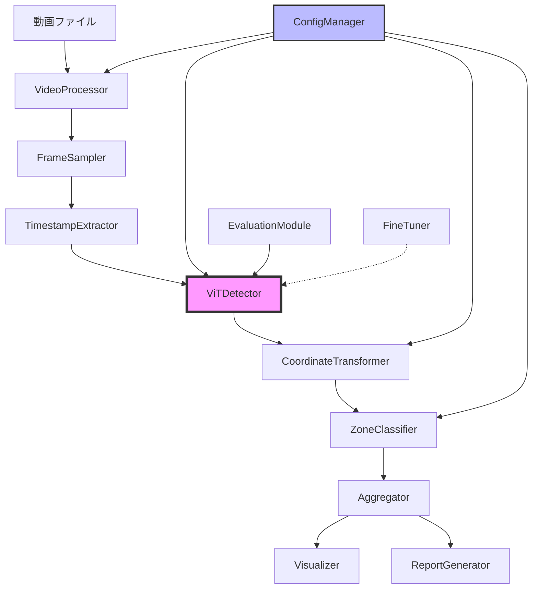

# 設計書

## 概要

本システムは、Vision Transformer（ViT）ベースの物体検出モデルを使用して、オフィス内の定点カメラ映像から人物を検出し、フロアマップ上でのゾーン別人数集計を実現するバッチ処理システムです。

### 主要機能

- 動画ファイルからの 5 分間隔フレーム抽出
- ViT（DETR/ViT-Det）による人物検出
- ホモグラフィ変換によるカメラ座標 → フロアマップ座標変換
- ゾーン判定と人数集計
- 精度評価とファインチューニング（オプション）
- 可視化とレポート出力

### 技術スタック

- **言語**: Python 3.10+
- **深層学習フレームワーク**: PyTorch 2.0+ (MPS 対応)
- **ViT モデル**: Hugging Face Transformers (facebook/detr-resnet-50 または microsoft/vit-det)
- **画像処理**: OpenCV, Pillow
- **数値計算**: NumPy
- **設定管理**: PyYAML
- **可視化**: Matplotlib
- **OCR**: pytesseract (タイムスタンプ読み取り用)

## アーキテクチャ

### システム構成図



````

### データフロー

1. **入力**: `input/merged_moviefiles.mov` (1280×720, 30fps、タイムラプス動画)
2. **タイムスタンプ抽出**: 全フレームをスキャンし、右上のタイムスタンプをOCR読み取り
3. **フレーム抽出**: タイムスタンプベースで5分刻み（12:10, 12:15, 12:20...）のフレームを選定（±10秒許容）
4. **人物検出**: ViTモデルによるバウンディングボックス検出
5. **座標変換**: カメラ座標→フロアマップ座標（ホモグラフィ変換）
6. **ゾーン判定**: 点in多角形アルゴリズムによるゾーン分類
7. **集計**: ゾーン別人数カウント
8. **出力**: CSV、画像、グラフ

## コンポーネントとインターフェース

### 1. ConfigManager

設定ファイル（YAML/JSON）の読み込みと検証を担当。

```python
class ConfigManager:
    """設定ファイル管理クラス"""

    def __init__(self, config_path: str = "config.yaml"):
        self.config_path = config_path
        self.config = self._load_config()

    def _load_config(self) -> dict:
        """設定ファイルを読み込む"""
        pass

    def validate(self) -> bool:
        """設定値の妥当性を検証"""
        pass

    def get(self, key: str, default=None):
        """設定値を取得"""
        pass
````

**設定ファイル構造（config.yaml）**:

```yaml
video:
  input_path: "input/merged_moviefiles.mov"
  is_timelapse: true
  frame_interval_minutes: 5 # タイムスタンプベースの5分刻み
  tolerance_seconds: 10 # ±10秒の許容誤差

detection:
  model_name: "facebook/detr-resnet-50" # または "microsoft/vit-det-base"
  confidence_threshold: 0.5
  nms_threshold: 0.4
  patch_size: 16
  device: "mps" # mps, cuda, cpu
  batch_size: 4

homography:
  matrix: [[1.2, 0.1, -50], [0.05, 1.3, -30], [0.0001, 0.0002, 1]]

zones:
  - id: "zone_a"
    name: "会議室エリア"
    polygon: [[100, 200], [300, 200], [300, 400], [100, 400]]
  - id: "zone_b"
    name: "デスクエリア"
    polygon: [[350, 150], [600, 150], [600, 500], [350, 500]]

output:
  directory: "output"
  save_detection_images: true
  save_floormap_images: true
  debug_mode: false

evaluation:
  ground_truth_path: "output/labels/result_fixed.json"
  iou_threshold: 0.5

fine_tuning:
  enabled: false
  dataset_path: "data/office_dataset"
  epochs: 50
  learning_rate: 0.0001
  batch_size: 8
  warmup_epochs: 5
  layer_decay: 0.65
```

### 2. VideoProcessor

動画ファイルの読み込みと基本処理を担当。

```python
class VideoProcessor:
    """動画処理クラス"""

    def __init__(self, video_path: str):
        self.video_path = video_path
        self.cap = None
        self.fps = None
        self.total_frames = None

    def open(self) -> bool:
        """動画ファイルを開く"""
        pass

    def get_frame(self, frame_number: int) -> np.ndarray:
        """指定フレームを取得"""
        pass

    def release(self):
        """リソースを解放"""
        pass
```

### 3. FrameSampler

タイムスタンプベースの 5 分刻みフレーム抽出を担当。

```python
class FrameSampler:
    """フレームサンプリングクラス（タイムスタンプベース）"""

    def __init__(self, interval_minutes: int = 5, tolerance_seconds: int = 10):
        self.interval_minutes = interval_minutes
        self.tolerance_seconds = tolerance_seconds

    def find_target_timestamps(self, start_time: str, end_time: str) -> List[str]:
        """開始・終了時刻から5分刻みの目標タイムスタンプリストを生成
        例: 12:10, 12:15, 12:20, ...
        """
        pass

    def find_closest_frame(self, target_timestamp: str, frame_timestamps: Dict[int, str]) -> Optional[int]:
        """目標タイムスタンプに最も近いフレーム番号を返す（±10秒以内）"""
        pass

    def extract_sample_frames(self, video_processor: VideoProcessor, timestamp_extractor: TimestampExtractor) -> List[Tuple[int, str]]:
        """動画全体をスキャンし、5分刻みのフレームを抽出
        Returns: [(frame_number, timestamp), ...]
        """
        pass
```

### 4. TimestampExtractor

フレームからタイムスタンプを抽出（右上の固定位置）。

```python
class TimestampExtractor:
    """タイムスタンプ抽出クラス"""

    def __init__(self, roi: Tuple[int, int, int, int] = None):
        self.roi = roi or (900, 10, 350, 60)  # デフォルト: 右上領域 (x, y, width, height)

    def extract(self, frame: np.ndarray) -> Optional[str]:
        """フレームからタイムスタンプを抽出
        Returns: "HH:MM" 形式の文字列、または None（読み取り失敗時）
        """
        pass

    def _preprocess_roi(self, frame: np.ndarray) -> np.ndarray:
        """OCR用の前処理（二値化、ノイズ除去、コントラスト強調）"""
        pass

    def parse_timestamp(self, ocr_text: str) -> Optional[str]:
        """OCR結果から時刻を抽出・正規化（HH:MM形式）"""
        pass
```

### 5. ViTDetector

Vision Transformer ベースの人物検出エンジン。

```python
class ViTDetector:
    """Vision Transformer人物検出クラス"""

    def __init__(self, model_name: str, confidence_threshold: float = 0.5, device: str = "mps"):
        self.model_name = model_name
        self.confidence_threshold = confidence_threshold
        self.device = device
        self.model = None
        self.processor = None

    def load_model(self):
        """事前学習済みViTモデルをロード"""
        # Hugging Face Transformersから読み込み
        # facebook/detr-resnet-50 または microsoft/vit-det-base
        pass

    def detect(self, frame: np.ndarray) -> List[Detection]:
        """人物検出を実行"""
        pass

    def _preprocess(self, frame: np.ndarray) -> torch.Tensor:
        """入力画像の前処理（パッチ分割、正規化）"""
        pass

    def _postprocess(self, outputs) -> List[Detection]:
        """モデル出力を検出結果に変換"""
        pass

    def get_attention_map(self, frame: np.ndarray) -> np.ndarray:
        """Attention Mapを取得（可視化用）"""
        pass
```

**Detection データクラス**:

```python
@dataclass
class Detection:
    """検出結果データクラス"""
    bbox: Tuple[float, float, float, float]  # (x, y, width, height)
    confidence: float
    class_id: int
    class_name: str
    camera_coords: Tuple[float, float]  # バウンディングボックス足元座標
    floor_coords: Optional[Tuple[float, float]] = None  # 変換後座標
    zone_ids: List[str] = field(default_factory=list)
```

### 6. CoordinateTransformer

ホモグラフィ変換によるカメラ座標 → フロアマップ座標変換。

```python
class CoordinateTransformer:
    """座標変換クラス"""

    def __init__(self, homography_matrix: np.ndarray):
        self.H = np.array(homography_matrix)

    def transform(self, camera_point: Tuple[float, float]) -> Tuple[float, float]:
        """カメラ座標をフロアマップ座標に変換"""
        pass

    def transform_batch(self, camera_points: List[Tuple[float, float]]) -> List[Tuple[float, float]]:
        """バッチ変換"""
        pass

    def get_foot_position(self, bbox: Tuple[float, float, float, float]) -> Tuple[float, float]:
        """バウンディングボックスから足元座標を計算"""
        # 中心下端: (x + width/2, y + height)
        pass
```

### 7. ZoneClassifier

ゾーン判定（点 in 多角形アルゴリズム）。

```python
class ZoneClassifier:
    """ゾーン分類クラス"""

    def __init__(self, zones: List[dict]):
        self.zones = zones

    def classify(self, floor_point: Tuple[float, float]) -> List[str]:
        """座標が属するゾーンIDのリストを返す"""
        pass

    def _point_in_polygon(self, point: Tuple[float, float], polygon: List[Tuple[float, float]]) -> bool:
        """点が多角形内にあるか判定（Ray Casting Algorithm）"""
        pass
```

### 8. Aggregator

ゾーン別人数集計。

```python
class Aggregator:
    """集計クラス"""

    def __init__(self):
        self.results = []

    def aggregate_frame(self, timestamp: str, detections: List[Detection]):
        """1フレームの集計結果を追加"""
        pass

    def get_zone_counts(self, detections: List[Detection]) -> Dict[str, int]:
        """ゾーン別人数をカウント"""
        pass

    def export_csv(self, output_path: str):
        """CSV形式でエクスポート"""
        pass

    def get_statistics(self) -> Dict[str, dict]:
        """各ゾーンの統計情報（平均、最大、最小）を計算"""
        pass
```

### 9. Visualizer

検出結果とフロアマップの可視化。

```python
class Visualizer:
    """可視化クラス"""

    def __init__(self, floormap_path: str, zones: List[dict]):
        self.floormap = cv2.imread(floormap_path)
        self.zones = zones

    def draw_detections(self, frame: np.ndarray, detections: List[Detection]) -> np.ndarray:
        """フレームに検出結果を描画"""
        pass

    def draw_floormap(self, detections: List[Detection], timestamp: str) -> np.ndarray:
        """フロアマップに人物位置をプロット"""
        pass

    def draw_zones(self, image: np.ndarray) -> np.ndarray:
        """ゾーンを色分けして描画"""
        pass

    def plot_time_series(self, aggregator: Aggregator, output_path: str):
        """ゾーン別人数の時系列グラフを生成"""
        pass

    def draw_attention_map(self, frame: np.ndarray, attention_map: np.ndarray) -> np.ndarray:
        """Attention Mapをオーバーレイ表示"""
        pass
```

### 10. EvaluationModule

精度評価モジュール。

```python
class EvaluationModule:
    """精度評価クラス"""

    def __init__(self, ground_truth_path: str, iou_threshold: float = 0.5):
        self.ground_truth = self._load_ground_truth(ground_truth_path)
        self.iou_threshold = iou_threshold

    def evaluate(self, detections: Dict[str, List[Detection]]) -> dict:
        """精度指標を計算"""
        pass

    def calculate_iou(self, bbox1: Tuple, bbox2: Tuple) -> float:
        """IoUを計算"""
        pass

    def calculate_metrics(self, tp: int, fp: int, fn: int) -> dict:
        """Precision, Recall, F1-scoreを計算"""
        pass

    def export_report(self, metrics: dict, output_path: str):
        """評価レポートを出力"""
        pass
```

### 11. FineTuner（オプション）

ViT モデルのファインチューニング。

```python
class FineTuner:
    """ファインチューニングクラス"""

    def __init__(self, config: dict):
        self.config = config
        self.model = None
        self.train_loader = None
        self.val_loader = None

    def prepare_dataset(self):
        """Kaggleデータセットを準備"""
        pass

    def train(self):
        """ファインチューニングを実行"""
        pass

    def _get_optimizer(self) -> torch.optim.Optimizer:
        """Layer-wise Learning Rate Decayを適用したOptimizerを取得"""
        pass

    def _get_scheduler(self) -> torch.optim.lr_scheduler:
        """Warmupスケジューラを取得"""
        pass

    def save_model(self, output_path: str):
        """ファインチューニング後のモデルを保存"""
        pass

    def compare_performance(self, before_metrics: dict, after_metrics: dict):
        """ファインチューニング前後の精度比較レポートを生成"""
        pass
```

## データモデル

### Detection（検出結果）

```python
@dataclass
class Detection:
    bbox: Tuple[float, float, float, float]  # (x, y, width, height)
    confidence: float
    class_id: int
    class_name: str
    camera_coords: Tuple[float, float]
    floor_coords: Optional[Tuple[float, float]] = None
    zone_ids: List[str] = field(default_factory=list)
```

### FrameResult（フレーム処理結果）

```python
@dataclass
class FrameResult:
    frame_number: int
    timestamp: str
    detections: List[Detection]
    zone_counts: Dict[str, int]
```

### AggregationResult（集計結果）

```python
@dataclass
class AggregationResult:
    timestamp: str
    zone_id: str
    count: int
```

### EvaluationMetrics（評価指標）

```python
@dataclass
class EvaluationMetrics:
    precision: float
    recall: float
    f1_score: float
    true_positives: int
    false_positives: int
    false_negatives: int
    confidence_threshold: float
```

## エラーハンドリング

### エラー分類と対応

1. **ファイル入出力エラー**

   - 動画ファイル不在 → エラーメッセージ出力、処理中断
   - 設定ファイル不在 → 警告出力、デフォルト設定使用
   - 出力ディレクトリ作成失敗 → エラーメッセージ出力、処理中断

2. **モデルロードエラー**

   - ViT モデルロード失敗 → エラーメッセージ出力、処理中断
   - MPS 利用不可 → 警告出力、CPU にフォールバック

3. **処理エラー**

   - フレーム読み込み失敗 → エラーログ記録、次フレームへスキップ
   - 検出処理失敗 → エラーログ記録、次フレームへスキップ
   - ホモグラフィ変換失敗 → エラーメッセージ出力、処理中断

4. **設定エラー**
   - 不正な設定値 → エラーメッセージ出力、処理中断
   - ホモグラフィ行列未設定 → エラーメッセージ出力、処理中断

### ロギング戦略

```python
import logging

# ログ設定
logging.basicConfig(
    level=logging.INFO,
    format='%(asctime)s - %(name)s - %(levelname)s - %(message)s',
    handlers=[
        logging.FileHandler('output/system.log'),
        logging.StreamHandler()
    ]
)

logger = logging.getLogger(__name__)
```

## テスト戦略

### 1. ユニットテスト

各コンポーネントの単体テスト。

- `test_config_manager.py`: 設定ファイル読み込み、検証
- `test_frame_sampler.py`: フレームサンプリングロジック
- `test_coordinate_transformer.py`: ホモグラフィ変換の正確性
- `test_zone_classifier.py`: 点 in 多角形アルゴリズム
- `test_aggregator.py`: 集計ロジック

### 2. 統合テスト

コンポーネント間の連携テスト。

- エンドツーエンド処理フロー
- 動画入力 → 検出 → 変換 → 集計 → 出力

### 3. 精度テスト

- Ground Truth データ（80 枚）を使用した精度評価
- 目標: F1-score ≥ 0.85

### 4. パフォーマンステスト

- フレーム処理時間: ≤ 2 秒/フレーム（MPS 使用時）
- メモリ使用量: ≤ 12GB
- 全処理時間: ≤ 10 分（1 時間動画）

## パフォーマンス最適化

### 1. MPS（Metal Performance Shaders）活用

```python
import torch

device = torch.device("mps" if torch.backends.mps.is_available() else "cpu")
model.to(device)
```

### 2. バッチ推論

複数フレームをまとめて処理。

```python
# バッチサイズ4で処理
batch_frames = [frame1, frame2, frame3, frame4]
detections_batch = detector.detect_batch(batch_frames)
```

### 3. Attention 計算の最適化

- Flash Attention の使用（PyTorch 2.0+）
- Attention Mask の効率的な実装

### 4. メモリ管理

- 不要なフレームデータの即時解放
- Attention Map のオンデマンド生成（デバッグモード時のみ）

## セキュリティ考慮事項

1. **入力検証**

   - 動画ファイル形式の検証
   - 設定ファイルの妥当性チェック

2. **パス操作**

   - パストラバーサル攻撃の防止
   - 出力ディレクトリの制限

3. **依存関係**
   - 定期的なライブラリアップデート
   - 脆弱性スキャン

## デプロイメント

### ディレクトリ構造

```
office-person-detection/
├── config.yaml
├── main.py
├── src/
│   ├── __init__.py
│   ├── config_manager.py
│   ├── video_processor.py
│   ├── frame_sampler.py
│   ├── timestamp_extractor.py
│   ├── vit_detector.py
│   ├── coordinate_transformer.py
│   ├── zone_classifier.py
│   ├── aggregator.py
│   ├── visualizer.py
│   ├── evaluation_module.py
│   └── fine_tuner.py
├── input/
│   └── merged_moviefiles.mov
├── data/
│   └── floormap.png
├── output/
│   ├── labels/
│   │   └── result_fixed.json
│   ├── detections/
│   ├── floormaps/
│   ├── graphs/
│   ├── zone_counts.csv
│   └── system.log
├── models/
│   └── finetuned_vit.pth (オプション)
├── tests/
│   ├── test_config_manager.py
│   ├── test_frame_sampler.py
│   └── ...
├── requirements.txt
└── README.md
```

### 依存関係（requirements.txt）

```
torch>=2.0.0
torchvision>=0.15.0
transformers>=4.30.0
opencv-python>=4.8.0
Pillow>=10.0.0
numpy>=1.24.0
PyYAML>=6.0
matplotlib>=3.7.0
pytesseract>=0.3.10
scikit-learn>=1.3.0
tqdm>=4.65.0
```

### 実行方法

```bash
# 環境構築
python -m venv venv
source venv/bin/activate
pip install -r requirements.txt

# 通常実行
python main.py --config config.yaml

# 評価モード
python main.py --config config.yaml --evaluate

# ファインチューニング
python main.py --config config.yaml --fine-tune
```

## 設計上の決定事項と根拠

### 1. ViT モデルの選択

**決定**: DETR（DEtection TRansformer）または ViT-Det を使用

**根拠**:

- End-to-End の物体検出が可能
- Self-Attention による画像全体の文脈理解
- Attention Map 可視化による解釈性
- Hugging Face Transformers で容易に利用可能

### 2. バッチ処理アーキテクチャ

**決定**: リアルタイム処理ではなく、録画済み動画のバッチ処理

**根拠**:

- 要件 1.1: 録画済みファイルからの処理
- ViT の推論時間（2 秒/フレーム）を考慮
- 5 分間隔サンプリングで処理負荷を軽減

### 3. ホモグラフィ変換の採用

**決定**: 3×3 変換行列による射影変換

**根拠**:

- 定点カメラの透視歪みを補正
- OpenCV で効率的に実装可能
- 設定ファイルで柔軟に調整可能

### 4. MPS（Metal Performance Shaders）の活用

**決定**: Apple Silicon GPU を優先的に使用

**根拠**:

- 要件 10: Apple M1 Max 環境での最適化
- PyTorch 2.0+の MPS サポート
- Transformer 演算の高速化

### 5. モジュラー設計

**決定**: 各機能を独立したクラスとして実装

**根拠**:

- テスト容易性の向上
- 将来的な機能拡張への対応
- コンポーネントの再利用性

## 今後の拡張可能性

1. **リアルタイム処理対応**

   - ストリーミング入力のサポート
   - 軽量モデル（MobileViT）への切り替え

2. **追跡機能**

   - 人物 ID の追跡（Re-identification）
   - 動線分析

3. **異常検知**

   - 混雑度の異常検知
   - 立ち入り禁止エリアの監視

4. **マルチカメラ対応**
   - 複数カメラの統合
   - カメラ間の人物対応付け
