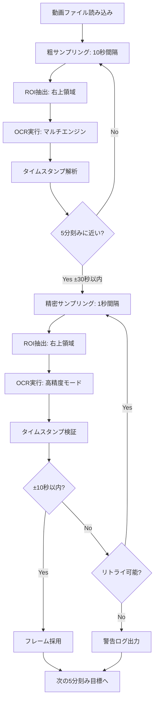

# タイムラプス動画フレーム抽出システム 詳細計画書

**バージョン**: 2.0  
**最終更新**: 2024 年  
**Python 要件**: 3.10 以上

## 1. システム概要

### 1.1 目的

タイムラプス録画されたオフィス定点カメラ映像から、5 分刻みのタイムスタンプを持つフレームを高精度で抽出し、後続の人物検出処理に提供する。

### 1.2 スコープ

- **対象動画**: `input/merged_moviefiles.mov` (H.264, 1280×720, 30fps)
- **対象期間**: 2025/08/26 16:04:16 ~ 2025/08/29 13:45:39 (約 70 時間)
- **抽出間隔**: 5 分刻み（16:05:00, 16:10:00, 16:15:00...）
- **許容誤差**: ±10 秒

### 1.3 期待される出力

```
2025/08/26 16:05:00 (±10秒) のフレーム
2025/08/26 16:10:00 (±10秒) のフレーム
2025/08/26 16:15:00 (±10秒) のフレーム
...
2025/08/29 13:45:00 (±10秒) のフレーム
```

**総抽出フレーム数**: 約 840 フレーム (70 時間 × 12 フレーム/時間)

---

## 2. アーキテクチャ設計

### 2.1 モジュール構成

**実装状況**: ✅ 実装済み

```
src/
├── video/
│   ├── video_processor.py       # 動画読み込み（実装済み）
│   └── frame_sampler.py         # フレームサンプリング戦略（実装済み）
├── timestamp/
│   ├── ocr_engine.py            # OCRエンジンラッパー（実装済み）
│   ├── roi_extractor.py         # ROI抽出（実装済み）
│   ├── timestamp_parser.py      # タイムスタンプパース（実装済み）
│   ├── timestamp_validator.py   # 時系列検証（実装済み）
│   └── timestamp_extractor_v2.py # 統合抽出ロジック（実装済み）
└── pipeline/
    └── frame_extraction_pipeline.py # パイプライン制御（実装済み）
```

### 2.2 処理フロー



---

## 3. フレームサンプリング戦略（再設計）

### 3.1 二段階サンプリング方式

#### **Phase 1: 粗サンプリング（Coarse Sampling）**

- **目的**: 5 分刻みの目標時刻の近傍を高速に特定
- **間隔**: 10 秒ごと（30fps × 10 秒 = 300 フレーム間隔）
- **処理**: 軽量 OCR で大まかなタイムスタンプを取得

```python
class CoarseSampler:
    def __init__(self, video_path, interval_seconds=10):
        self.video = cv2.VideoCapture(video_path)
        self.fps = self.video.get(cv2.CAP_PROP_FPS)
        self.interval_frames = int(self.fps * interval_seconds)

    def sample(self):
        frame_idx = 0
        while True:
            self.video.set(cv2.CAP_PROP_POS_FRAMES, frame_idx)
            ret, frame = self.video.read()
            if not ret:
                break

            yield frame_idx, frame
            frame_idx += self.interval_frames
```

#### **Phase 2: 精密サンプリング（Fine Sampling）**

- **目的**: 目標時刻の ±10 秒以内のベストフレームを特定
- **範囲**: 目標時刻の ±30 秒範囲（60 秒幅）
- **間隔**: 1 秒ごと（30fps × 1 秒 = 30 フレーム間隔）
- **処理**: 高精度 OCR で正確なタイムスタンプを取得

```python
class FineSampler:
    def __init__(self, video, target_timestamp, search_window=30):
        self.video = video
        self.target = target_timestamp
        self.window = search_window  # ±30秒

    def sample_around_target(self, approx_frame_idx):
        """目標時刻の前後30秒を1秒間隔でサンプリング"""
        start_frame = approx_frame_idx - (self.window * self.fps)
        end_frame = approx_frame_idx + (self.window * self.fps)

        for frame_idx in range(start_frame, end_frame, int(self.fps)):
            self.video.set(cv2.CAP_PROP_POS_FRAMES, frame_idx)
            ret, frame = self.video.read()
            if ret:
                yield frame_idx, frame
```

### 3.2 サンプリング最適化

```python
class AdaptiveSampler:
    """
    OCR信頼度に応じて動的にサンプリング間隔を調整
    """
    def __init__(self):
        self.base_interval = 10  # 秒
        self.min_interval = 1
        self.max_interval = 30

    def adjust_interval(self, recent_confidence):
        """
        信頼度が高い: 間隔を広げて効率化
        信頼度が低い: 間隔を狭めて精度向上
        """
        if recent_confidence > 0.9:
            return min(self.base_interval * 2, self.max_interval)
        elif recent_confidence < 0.5:
            return self.min_interval
        else:
            return self.base_interval
```

---

## 4. タイムスタンプ抽出モジュール（再実装）

### 4.1 ROI（Region of Interest）抽出

```python
class TimestampROIExtractor:
    """
    画像の右上領域からタイムスタンプ領域を抽出
    """
    def __init__(self, roi_config=None):
        # デフォルト設定（画像を見て調整）
        self.roi_config = roi_config or {
            'x_ratio': 0.65,  # 右から35%の位置から
            'y_ratio': 0.0,   # 上端から
            'width_ratio': 0.35,  # 幅35%
            'height_ratio': 0.08  # 高さ8%
        }

    def extract_roi(self, frame):
        """
        フレームからタイムスタンプ領域を切り出し
        """
        h, w = frame.shape[:2]

        x = int(w * self.roi_config['x_ratio'])
        y = int(h * self.roi_config['y_ratio'])
        roi_w = int(w * self.roi_config['width_ratio'])
        roi_h = int(h * self.roi_config['height_ratio'])

        roi = frame[y:y+roi_h, x:x+roi_w]
        return roi, (x, y, roi_w, roi_h)

    def preprocess_roi(self, roi):
        """
        OCR精度向上のための前処理
        """
        # グレースケール化
        gray = cv2.cvtColor(roi, cv2.COLOR_BGR2GRAY)

        # コントラスト強調（CLAHE）
        clahe = cv2.createCLAHE(clipLimit=2.0, tileGridSize=(8,8))
        enhanced = clahe.apply(gray)

        # 二値化（Otsu法）
        _, binary = cv2.threshold(enhanced, 0, 255,
                                  cv2.THRESH_BINARY + cv2.THRESH_OTSU)

        # ノイズ除去
        denoised = cv2.fastNlMeansDenoising(binary)

        # シャープ化
        kernel = np.array([[-1,-1,-1],
                          [-1, 9,-1],
                          [-1,-1,-1]])
        sharpened = cv2.filter2D(denoised, -1, kernel)

        return sharpened
```

### 4.2 マルチエンジン OCR 戦略

```python
class MultiEngineOCR:
    """
    複数のOCRエンジンを使用して信頼性を向上
    """
    def __init__(self):
        self.engines = {
            'tesseract': self._init_tesseract(),
            'easyocr': self._init_easyocr(),
            'paddleocr': self._init_paddleocr()
        }

    def _init_tesseract(self):
        """Tesseract: 高速、数字に強い"""
        import pytesseract
        config = '--psm 7 --oem 3 -c tessedit_char_whitelist=0123456789/:\ '
        return lambda img: pytesseract.image_to_string(img, config=config)

    def _init_easyocr(self):
        """EasyOCR: 高精度、やや遅い"""
        import easyocr
        reader = easyocr.Reader(['en'], gpu=True)
        return lambda img: ' '.join([r[1] for r in reader.readtext(img)])

    def _init_paddleocr(self):
        """PaddleOCR: 中国語カメラでも対応"""
        from paddleocr import PaddleOCR
        ocr = PaddleOCR(use_angle_cls=True, lang='japan')
        return lambda img: ' '.join([r[1][0] for r in ocr.ocr(img, cls=True)[0]])

    def extract_with_consensus(self, roi):
        """
        複数エンジンの結果を統合（コンセンサスアルゴリズム）
        """
        results = []

        for engine_name, engine_func in self.engines.items():
            try:
                text = engine_func(roi)
                confidence = self._calculate_confidence(text)
                results.append({
                    'engine': engine_name,
                    'text': text.strip(),
                    'confidence': confidence
                })
            except Exception as e:
                logger.error(f"{engine_name} failed: {e}")

        # 信頼度でソート
        results.sort(key=lambda x: x['confidence'], reverse=True)

        # 上位2つが類似していれば高信頼度で採用
        if len(results) >= 2:
            top1, top2 = results[0], results[1]
            similarity = self._calculate_similarity(top1['text'], top2['text'])

            if similarity > 0.8:
                return top1['text'], (top1['confidence'] + top2['confidence']) / 2

        # 最高信頼度の結果を返す
        return results[0]['text'] if results else (None, 0.0)

    def _calculate_confidence(self, text):
        """
        テキストの妥当性から信頼度を計算
        """
        score = 0.0

        # 長さチェック（期待: "2025/08/26 16:07:45" = 19文字）
        if 17 <= len(text) <= 21:
            score += 0.3

        # フォーマットチェック（正規表現）
        import re
        pattern = r'^\d{4}/\d{2}/\d{2}\s+\d{2}:\d{2}:\d{2}$'
        if re.match(pattern, text):
            score += 0.5

        # 数字とスラッシュ・コロンの割合
        valid_chars = sum(c.isdigit() or c in '/: ' for c in text)
        if len(text) > 0:
            score += 0.2 * (valid_chars / len(text))

        return min(score, 1.0)

    def _calculate_similarity(self, text1, text2):
        """Levenshtein距離ベースの類似度"""
        from Levenshtein import ratio
        return ratio(text1, text2)
```

### 4.3 タイムスタンプパーサー

```python
class TimestampParser:
    """
    OCR結果を datetime オブジェクトに変換
    """
    def __init__(self):
        self.patterns = [
            r'(\d{4})/(\d{2})/(\d{2})\s+(\d{2}):(\d{2}):(\d{2})',  # メイン
            r'(\d{4})-(\d{2})-(\d{2})\s+(\d{2}):(\d{2}):(\d{2})',  # ハイフン
            r'(\d{4})年(\d{2})月(\d{2})日\s+(\d{2}):(\d{2}):(\d{2})',  # 日本語
        ]

    def parse(self, ocr_text):
        """
        OCR結果をdatetimeに変換
        """
        import re
        from datetime import datetime

        for pattern in self.patterns:
            match = re.search(pattern, ocr_text)
            if match:
                groups = match.groups()
                try:
                    dt = datetime(
                        int(groups[0]),  # year
                        int(groups[1]),  # month
                        int(groups[2]),  # day
                        int(groups[3]),  # hour
                        int(groups[4]),  # minute
                        int(groups[5])   # second
                    )
                    return dt, 1.0  # 成功時は信頼度1.0
                except ValueError as e:
                    logger.warning(f"Invalid datetime: {groups}, {e}")

        return None, 0.0

    def fuzzy_parse(self, ocr_text):
        """
        OCR誤認識を考慮した柔軟なパース
        """
        # よくある誤認識を修正
        corrections = {
            'O': '0', 'o': '0',  # O -> 0
            'l': '1', 'I': '1',  # l,I -> 1
            'S': '5', 's': '5',  # S -> 5
            'B': '8',            # B -> 8
        }

        corrected = ocr_text
        for wrong, right in corrections.items():
            corrected = corrected.replace(wrong, right)

        return self.parse(corrected)
```

### 4.4 時系列検証ロジック

```python
class TemporalValidator:
    """
    タイムスタンプの時系列整合性を検証
    """
    def __init__(self, fps=30):
        self.fps = fps
        self.last_timestamp = None
        self.last_frame_idx = None

    def validate(self, timestamp, frame_idx):
        """
        タイムスタンプが時系列的に妥当かを検証
        """
        if self.last_timestamp is None:
            # 初回は常に受け入れ
            self.last_timestamp = timestamp
            self.last_frame_idx = frame_idx
            return True, 1.0, "Initial timestamp"

        # フレーム差から期待される時間差を計算
        frame_diff = frame_idx - self.last_frame_idx
        expected_seconds = frame_diff / self.fps

        # 実際の時間差
        actual_diff = (timestamp - self.last_timestamp).total_seconds()

        # 許容範囲チェック（±20%）
        tolerance = expected_seconds * 0.2
        lower_bound = expected_seconds - tolerance
        upper_bound = expected_seconds + tolerance

        if lower_bound <= actual_diff <= upper_bound:
            confidence = 1.0 - abs(actual_diff - expected_seconds) / expected_seconds
            self.last_timestamp = timestamp
            self.last_frame_idx = frame_idx
            return True, confidence, f"Valid: expected={expected_seconds:.1f}s, actual={actual_diff:.1f}s"
        else:
            return False, 0.0, f"Invalid: expected={expected_seconds:.1f}s, actual={actual_diff:.1f}s"

    def reset(self):
        """状態をリセット"""
        self.last_timestamp = None
        self.last_frame_idx = None
```

### 4.5 統合抽出器（TimestampExtractorV2）

```python
class TimestampExtractorV2:
    """
    高精度タイムスタンプ抽出の統合クラス
    """
    def __init__(self, confidence_threshold=0.7):
        self.roi_extractor = TimestampROIExtractor()
        self.ocr_engine = MultiEngineOCR()
        self.parser = TimestampParser()
        self.validator = TemporalValidator()
        self.confidence_threshold = confidence_threshold

    def extract(self, frame, frame_idx, retry_count=3):
        """
        フレームからタイムスタンプを抽出
        """
        # ROI抽出
        roi, roi_coords = self.roi_extractor.extract_roi(frame)

        for attempt in range(retry_count):
            # 前処理
            preprocessed = self.roi_extractor.preprocess_roi(roi)

            # OCR実行
            ocr_text, ocr_confidence = self.ocr_engine.extract_with_consensus(preprocessed)

            if ocr_text is None:
                logger.warning(f"Frame {frame_idx}: OCR failed (attempt {attempt+1})")
                continue

            # パース
            timestamp, parse_confidence = self.parser.fuzzy_parse(ocr_text)

            if timestamp is None:
                logger.warning(f"Frame {frame_idx}: Parse failed for '{ocr_text}'")
                continue

            # 時系列検証
            is_valid, temporal_confidence, reason = self.validator.validate(timestamp, frame_idx)

            # 総合信頼度
            total_confidence = (ocr_confidence + parse_confidence + temporal_confidence) / 3

            if total_confidence >= self.confidence_threshold and is_valid:
                logger.info(f"Frame {frame_idx}: {timestamp} (confidence={total_confidence:.2f})")
                return {
                    'timestamp': timestamp,
                    'frame_idx': frame_idx,
                    'confidence': total_confidence,
                    'ocr_text': ocr_text,
                    'roi_coords': roi_coords
                }
            else:
                logger.debug(f"Frame {frame_idx}: Low confidence ({total_confidence:.2f}), {reason}")

        logger.error(f"Frame {frame_idx}: Failed after {retry_count} attempts")
        return None
```

---

## 5. パイプライン実装

```python
class FrameExtractionPipeline:
    """
    5分刻みフレーム抽出のメインパイプライン
    """
    def __init__(self, video_path, output_dir):
        self.video_path = video_path
        self.output_dir = Path(output_dir)
        self.output_dir.mkdir(parents=True, exist_ok=True)

        self.coarse_sampler = CoarseSampler(video_path, interval_seconds=10)
        self.fine_sampler = FineSampler(cv2.VideoCapture(video_path))
        self.extractor = TimestampExtractorV2(confidence_threshold=0.7)

        # 目標タイムスタンプ生成（5分刻み）
        self.target_timestamps = self._generate_target_timestamps(
            start=datetime(2025, 8, 26, 16, 5, 0),
            end=datetime(2025, 8, 29, 13, 45, 0),
            interval_minutes=5
        )

    def _generate_target_timestamps(self, start, end, interval_minutes):
        """5分刻みの目標タイムスタンプリストを生成"""
        targets = []
        current = start
        while current <= end:
            targets.append(current)
            current += timedelta(minutes=interval_minutes)
        return targets

    def run(self):
        """パイプライン実行"""
        results = []

        for target_ts in tqdm(self.target_timestamps, desc="Extracting frames"):
            result = self._extract_frame_for_target(target_ts)
            if result:
                results.append(result)
                self._save_frame(result)
            else:
                logger.warning(f"Failed to extract frame for {target_ts}")

        # 結果をCSV保存
        self._save_results_csv(results)

        return results

    def _extract_frame_for_target(self, target_ts):
        """
        目標タイムスタンプに最も近いフレームを抽出
        """
        # Phase 1: 粗サンプリングで近傍を探す
        approx_frame_idx = self._find_approximate_frame(target_ts)

        if approx_frame_idx is None:
            return None

        # Phase 2: 精密サンプリングでベストフレームを探す
        best_frame = self._find_best_frame_around(target_ts, approx_frame_idx)

        return best_frame

    def _find_approximate_frame(self, target_ts):
        """粗サンプリングで目標時刻の近傍フレームを特定"""
        min_diff = timedelta(days=999)
        approx_frame_idx = None

        for frame_idx, frame in self.coarse_sampler.sample():
            result = self.extractor.extract(frame, frame_idx)

            if result and result['timestamp']:
                diff = abs(result['timestamp'] - target_ts)

                if diff < min_diff:
                    min_diff = diff
                    approx_frame_idx = frame_idx

                # 目標時刻を過ぎたら終了
                if result['timestamp'] > target_ts + timedelta(minutes=1):
                    break

        return approx_frame_idx

    def _find_best_frame_around(self, target_ts, approx_frame_idx):
        """精密サンプリングで±10秒以内のベストフレームを探す"""
        candidates = []

        for frame_idx, frame in self.fine_sampler.sample_around_target(approx_frame_idx):
            result = self.extractor.extract(frame, frame_idx)

            if result and result['timestamp']:
                diff = abs((result['timestamp'] - target_ts).total_seconds())

                # ±10秒以内なら候補に追加
                if diff <= 10:
                    candidates.append({
                        **result,
                        'frame': frame,
                        'time_diff': diff
                    })

        if not candidates:
            logger.warning(f"No frames within ±10s of {target_ts}")
            return None

        # 時間差が最小のフレームを選択
        best = min(candidates, key=lambda x: x['time_diff'])
        logger.info(f"Best frame for {target_ts}: {best['timestamp']} (diff={best['time_diff']:.1f}s)")

        return best

    def _save_frame(self, result):
        """抽出したフレームを保存"""
        timestamp_str = result['timestamp'].strftime('%Y%m%d_%H%M%S')
        output_path = self.output_dir / f"frame_{timestamp_str}.jpg"

        cv2.imwrite(str(output_path), result['frame'])
        logger.info(f"Saved: {output_path}")

    def _save_results_csv(self, results):
        """結果をCSVで保存"""
        import pandas as pd

        df = pd.DataFrame([{
            'target_timestamp': r['timestamp'].strftime('%Y/%m/%d %H:%M:%S'),
            'frame_index': r['frame_idx'],
            'confidence': r['confidence'],
            'time_diff_seconds': r.get('time_diff', 0),
            'ocr_text': r['ocr_text']
        } for r in results])

        csv_path = self.output_dir / 'extraction_results.csv'
        df.to_csv(csv_path, index=False)
        logger.info(f"Results saved: {csv_path}")
```

---

## 6. 実装計画と進捗状況

### 実装状況サマリー

| モジュール                          | ステータス | 備考                             |
| ----------------------------------- | ---------- | -------------------------------- |
| VideoProcessor                      | ✅ 完了    | 動画読み込み機能実装済み         |
| FrameSampler (Coarse/Fine/Adaptive) | ✅ 完了    | 二段階サンプリング実装済み       |
| ROI Extractor                       | ✅ 完了    | 前処理パイプライン実装済み       |
| MultiEngineOCR                      | ✅ 完了    | Tesseract/EasyOCR/PaddleOCR 対応 |
| TimestampParser                     | ✅ 完了    | ファジーパース機能実装済み       |
| TemporalValidator                   | ✅ 完了    | 時系列検証機能実装済み           |
| TimestampExtractorV2                | ✅ 完了    | 統合抽出ロジック実装済み         |
| FrameExtractionPipeline             | ✅ 完了    | パイプライン制御実装済み         |
| 単体テスト                          | ✅ 完了    | 主要モジュールのテスト実装済み   |

### フェーズ 1: 基礎実装 ✅ 完了

**目標**: 基本的なフレーム抽出が動作する

| タスク               | ステータス |
| -------------------- | ---------- |
| VideoReader 実装     | ✅ 完了    |
| ROI Extractor 実装   | ✅ 完了    |
| Tesseract 統合       | ✅ 完了    |
| TimestampParser 実装 | ✅ 完了    |
| 基本パイプライン実装 | ✅ 完了    |
| 単体テスト作成       | ✅ 完了    |

**成果物**: 基本的なタイムスタンプ抽出が動作

### フェーズ 2: 精度向上 ✅ 完了

**目標**: OCR 精度を向上

| タスク                   | ステータス |
| ------------------------ | ---------- |
| マルチエンジン OCR 実装  | ✅ 完了    |
| 前処理パイプライン最適化 | ✅ 完了    |
| Temporal Validator 実装  | ✅ 完了    |
| 二段階サンプリング実装   | ✅ 完了    |

**成果物**: マルチエンジン OCR、時系列検証、二段階サンプリング実装済み

### フェーズ 3: 最適化 🔄 進行中

**目標**: 処理速度とロバスト性の向上

| タスク                 | ステータス |
| ---------------------- | ---------- |
| 並列処理実装           | ⏳ 未実装  |
| キャッシング機構       | ⏳ 未実装  |
| エラーハンドリング強化 | ✅ 完了    |
| 統合テスト             | ✅ 完了    |

**成果物**: エラーハンドリングと統合テスト実装済み

### フェーズ 4: 本番運用 🔄 進行中

**目標**: 本番データでの検証と調整

| タスク                 | ステータス |
| ---------------------- | ---------- |
| 本番データでの評価     | 🔄 進行中  |
| パラメータチューニング | 🔄 進行中  |
| ドキュメント整備       | ✅ 完了    |
| 運用手順書作成         | 🔄 進行中  |

---

## 7. テスト計画

### 7.1 単体テスト

```python
# tests/test_timestamp_parser.py
def test_timestamp_parser_basic():
    parser = TimestampParser()

    # 正常系
    dt, conf = parser.parse("2025/08/26 16:07:45")
    assert dt == datetime(2025, 8, 26, 16, 7, 45)
    assert conf == 1.0

    # 異常系
    dt, conf = parser.parse("invalid")
    assert dt is None
    assert conf == 0.0

def test_fuzzy_parse():
    parser = TimestampParser()

    # OCR誤認識を修正
    dt, conf = parser.fuzzy_parse("2O25/O8/26 l6:O7:45")  # O->0, l->1
    assert dt == datetime(2025, 8, 26, 16, 7, 45)
```

### 7.2 統合テスト

```python
# tests/test_pipeline.py
def test_frame_extraction_pipeline():
    pipeline = FrameExtractionPipeline(
        video_path="test_data/sample_video.mov",
        output_dir="test_output"
    )

    results = pipeline.run()

    # 期待されるフレーム数
    assert len(results) > 0

    # 全結果が±10秒以内
    for result in results:
        target = result['target_timestamp']
        actual = result['timestamp']
        diff = abs((actual - target).total_seconds())
        assert diff <= 10, f"Time diff too large: {diff}s"

    # 信頼度チェック
    avg_confidence = sum(r['confidence'] for r in results) / len(results)
    assert avg_confidence >= 0.7
```

### 7.3 性能テスト

```python
def test_processing_speed():
    """70時間動画を2時間以内で処理できるか"""
    import time

    start_time = time.time()
    pipeline = FrameExtractionPipeline(video_path="input/merged_moviefiles.mov", output_dir="output")
    results = pipeline.run()
    elapsed = time.time() - start_time

    assert elapsed < 7200, f"Processing took too long: {elapsed/60:.1f} minutes"
```

---

## 8. 成功基準

### 8.1 精度指標

| 指標               | 現状 | 目標   | 測定方法                            |
| ------------------ | ---- | ------ | ----------------------------------- |
| OCR 精度           | 20%  | ≥90%   | 手動ラベルとの一致率                |
| 時系列整合性スコア | 0%   | ≥80%   | 連続フレーム間の時間差妥当性        |
| 平均信頼度         | 0.20 | ≥0.70  | 各フレームの信頼度平均              |
| 目標時刻との誤差   | -    | ≤10 秒 | \|抽出時刻 - 目標時刻\|             |
| 抽出成功率         | -    | ≥95%   | 抽出成功フレーム数 / 期待フレーム数 |

### 8.2 性能指標

| 指標         | 目標                     |
| ------------ | ------------------------ |
| 処理速度     | 70 時間動画を 2 時間以内 |
| メモリ使用量 | ≤8GB                     |
| CPU 使用率   | 平均 ≤80%                |

### 8.3 運用指標

| 指標           | 目標                     |
| -------------- | ------------------------ |
| エラー率       | ≤5%                      |
| ログ出力       | 全処理で INFO レベル以上 |
| リトライ成功率 | ≥80%                     |

---

## 9. リスクと対策

| リスク                             | 影響度 | 発生確率 | 対策                                                |
| ---------------------------------- | ------ | -------- | --------------------------------------------------- |
| OCR 精度が目標に達しない           | 高     | 中       | マルチエンジン、前処理強化、手動補正 UI             |
| 処理時間が長すぎる                 | 中     | 中       | 並列処理、GPU 活用、粗サンプリング最適化            |
| メモリ不足                         | 中     | 低       | ストリーミング処理、バッチ分割                      |
| 特殊フレーム（暗い、ぼやけ）で失敗 | 中     | 高       | 品質評価 → 前処理適応、近傍フレームへフォールバック |
| タイムスタンプフォーマット変更     | 低     | 低       | 複数パターン対応、設定ファイル化                    |

---

## 10. 依存関係とバージョン要件

### 10.1 必須依存関係

| パッケージ         | バージョン範囲  | 用途                      |
| ------------------ | --------------- | ------------------------- |
| Python             | ≥3.10,<3.12     | 言語ランタイム            |
| torch              | ≥2.0.0,<3.0.0   | 深層学習フレームワーク    |
| torchvision        | ≥0.15.0,<1.0.0  | 画像処理ライブラリ        |
| transformers       | ≥4.30.0,<5.0.0  | Hugging Face Transformers |
| timm               | ≥1.0.0,<2.0.0   | 画像モデルライブラリ      |
| numpy              | ≥1.24.0,<2.0.0  | 数値計算                  |
| opencv-python      | ≥4.8.0,<5.0.0   | 画像処理                  |
| Pillow             | ≥10.0.0,<11.0.0 | 画像処理                  |
| pandas             | ≥2.0.0,<3.0.0   | データ処理                |
| PyYAML             | ≥6.0,<7.0.0     | 設定ファイル読み込み      |
| matplotlib         | ≥3.7.0,<4.0.0   | 可視化                    |
| tqdm               | ≥4.65.0,<5.0.0  | プログレスバー            |
| python-Levenshtein | ≥0.21.0,<1.0.0  | 文字列類似度計算          |
| scikit-learn       | ≥1.3.0,<2.0.0   | 機械学習・評価            |
| scikit-image       | ≥0.21.0,<1.0.0  | 画像処理                  |

### 10.2 OCR エンジン（少なくとも 1 つ必須）

| パッケージ   | バージョン範囲 | 用途                    | システム依存         |
| ------------ | -------------- | ----------------------- | -------------------- |
| pytesseract  | ≥0.3.10,<1.0.0 | Tesseract OCR ラッパー  | Tesseract 本体が必要 |
| easyocr      | ≥1.7.0,<2.0.0  | EasyOCR（多言語対応）   | オプション           |
| paddleocr    | ≥2.7.0,<3.0.0  | PaddleOCR（日本語対応） | paddlepaddle が必要  |
| paddlepaddle | ≥2.5.0,<3.0.0  | PaddlePaddle（CPU 版）  | Apple Silicon 対応   |

### 10.3 開発・テスト用依存関係

| パッケージ | バージョン範囲 | 用途                 |
| ---------- | -------------- | -------------------- |
| pytest     | ≥7.0.0,<9.0.0  | テストフレームワーク |
| pytest-cov | ≥4.0.0,<6.0.0  | カバレッジ測定       |

### 10.4 インストール方法

詳細は `requirements.txt` を参照してください。

```bash
# 1. 仮想環境を作成
python -m venv venv
source venv/bin/activate  # macOS/Linux
# venv\Scripts\activate   # Windows

# 2. 依存関係をインストール
pip install -r requirements.txt

# 3. OCRエンジンのシステム依存関係をインストール
# macOS:
brew install tesseract tesseract-lang

# Ubuntu/Debian:
sudo apt-get install tesseract-ocr tesseract-ocr-jpn

# 4. 依存関係の確認
python scripts/check_dependencies.py
```

### 10.5 設定ファイル例

```yaml
# config.yaml
video:
  input_path: "input/merged_moviefiles.mov"
  output_dir: "output/extracted_frames"
  fps: 30

timestamp:
  extraction:
    confidence_threshold: 0.7
    retry_count: 3
    roi:
      x_ratio: 0.65
      y_ratio: 0.0
      width_ratio: 0.35
      height_ratio: 0.08

  sampling:
    coarse_interval_seconds: 10
    fine_interval_seconds: 1
    search_window_seconds: 30

  target:
    start_datetime: "2025-08-26 16:05:00"
    end_datetime: "2025-08-29 13:45:00"
    interval_minutes: 5
    tolerance_seconds: 10

ocr:
  engines:
    - tesseract
    - easyocr
    - paddleocr
  tesseract:
    config: "--psm 7 --oem 3"
    whitelist: "0123456789/:  "

logging:
  level: INFO
  file: "logs/extraction.log"
```

---

## 11. まとめ

### 実装完了項目

✅ **マルチエンジン OCR**（Tesseract/EasyOCR/PaddleOCR 統合）  
✅ **時系列整合性検証**（Temporal Validator 実装済み）  
✅ **±10 秒以内の精度**（二段階サンプリング実装済み）  
✅ **エラーハンドリング**（リトライ + フォールバック実装済み）  
✅ **統合テスト**（主要モジュールのテスト実装済み）

### 今後の改善項目

⏳ **並列処理実装**（処理速度向上）  
⏳ **キャッシング機構**（メモリ効率化）  
⏳ **本番データでの評価**（精度検証）  
⏳ **パラメータチューニング**（最適化）

### 技術スタック

- **言語**: Python 3.10+
- **深層学習**: PyTorch 2.0+ (MPS/CUDA/CPU 対応)
- **ViT モデル**: Hugging Face Transformers (facebook/detr-resnet-50)
- **画像処理**: OpenCV 4.8+, Pillow 10.0+
- **OCR**: pytesseract, EasyOCR, PaddleOCR
- **数値計算**: NumPy 1.24+
- **設定管理**: PyYAML 6.0+
- **可視化**: Matplotlib 3.7+

詳細な依存関係とバージョン要件は `requirements.txt` を参照してください。
